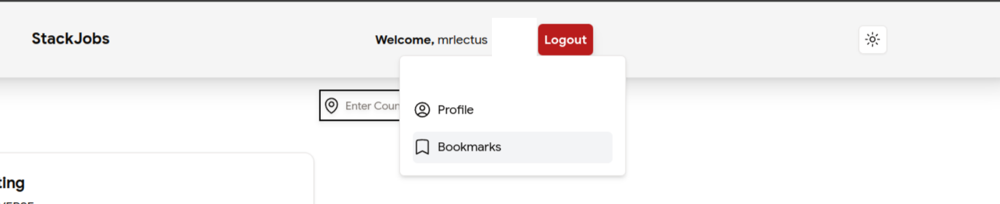

# Bounty - Build Your Affinidi-Powered Product

Affinidi aims to change the current approach to digital identity by empowering individuals to take control of their data an
d privacy.

## Affinidi Vault
Affinidi Vault enables you to discover, collect, store, share, and monetise your data in a fragmented data world. By levera
ging decentralised technologies, Affinidi Vault empowers greater control, adheres to privacy-by-design principles, and prio
ritises user-centricity at its core.

## Introduction

## StackJobs
A platform to find Jobs based on your Location (Information provided in Affinidi Vault). Note here that Jobs here are Just sample and not
real Jobs, this was just used to show how affinidi can help to speed up job application process by providing some necessary informations.

## Stack

- Nextjs
- Tailwindcss
- ShadcnUI
- NextAuth

## Features

- Enable Profile View
- Bookmark Jobs
- Apply For Jobs
- Email Notification
- Local currency converter

## Profile View
User can be able to view their profile to verify that it is correct that the information there is their own and it is correct. To view
profile the user has to click on their profile pic, this would open  popup menu where they can select the Profile option. It Looks something
like this..

## Bookmark Jobs
Users are able to add jobs they like to their bookmarks to review later, user can also remove said job from the bookmark, to access the
bookmark user have to click the profile icon and select the bookmark options.

## Job Application
User can apply for their desired job, note that jobs here are dummy jobs for demonstration purposes only and most of the Jobs are fake. But
users can apply for job as a demo.

## Email Notification
After A job is being applied for on the Board an email is being sent to the user base on the Affinidi email provided from Affinidi Vault
taht belongs to the User. This gives the user a sense of assurance that the Job has actually being applied for.

## Local Currency converter
Currency of the Job is being displayed in the user Local currency this currency is being converted from Euro to the User Local currency
using the help of an external API. This helps the user to know the Pay the company is actually offering without having to do the mental
calculations theirselves.

## Search Base on Country
The User can search Jobs in other country if the Job provided for them in their Country doesn't suite them. At the Top of the page there is
a search filter a user can use, available country that can be search include (Nigeria, United States, United Kingdom, China, Malaysia, Japan
Thailand, Singapore and Indonesia) if default country is not available, please use one of this countries to test and hist the search button.
